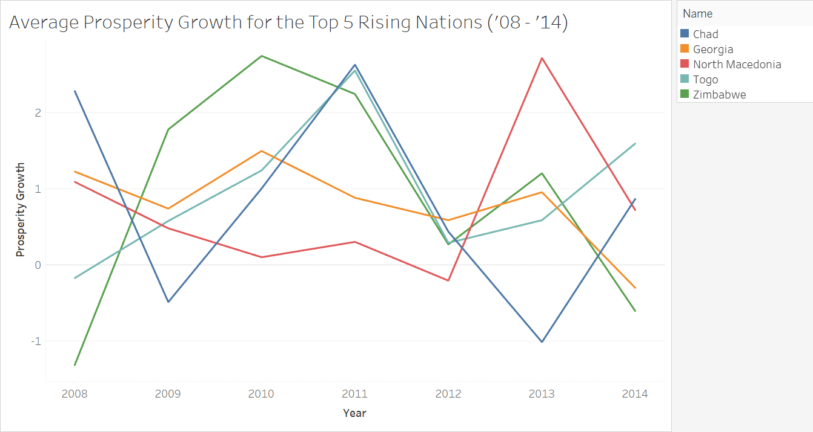

# Data Hack 2021 Report Prosperity Track II

Team: Tanuki
Members: Takashi Yabuta, Anurag Pamuru, Mizuki Kadowaki, Laura Diao

## INTRODUCTION
(a. Introduction to data)
Our dataset contains score values and rankings for 9 different societal pillars from 149 different countries from the years 2007-2014. Each pillar has multiple subcategories that contributed to the category ranking and score. 
The societal pillars are as follows:

- Business
- Economy
- Education
- Natural Environment
- Governance
- Health
- Personal Freedom
- Safety and Security
- Social Capital 

## DATA

Due to contract terms, we were not granted access to the results from the Gallup World Poll. Because of this, 
we removed variables that we did not have access to and only kept datapoints which had values for all variables.

In order to accomplish the task of finding which countries saw the highest prosperity growth over the period from
2007 to 2014, we calculated the Prosperity Score as the arithmetic mean of the scores for all pillars for each individual Country.
We then found the average growth/change in this metric over the 8 years for which we had data. These table manipulations gave us access
to the names of the top 5 countries in terms of "Average Prosperity Growth Per Year", which are seen below.

## OBSERVATIONS

| Country     | Average Prosperity Growth Per Year  | Most Important Pillar |
|-------------|-------------------------------------|-----------------------|
| Togo        | 0.955408                            | Safety and Security   |
| Zimbabwe    | 0.904582                            | Governance            |
| Chad        | 0.820001                            | Education             |
| Georgia     | 0.800023                            | Health                |
| Macedonia   | 0.745948                            | Social Capital        |

We calculated the most important pillar for each nation by seeing which pillar score was furthest in absolute distance
from the Prosperity Score each year. Then, we found which pillar was most frequently furthest from the prosperity across
all 8 years, which gives us the "Most Important Pillar" in determining the Prosperity Growth.

After doing so, we then trained a linear regression model on all the categories of each pillar and then peek into the 
models to find the largest linear regression coefficients of each pillar, which should ideally be correlated with 
the most important categories in that pillar. Here they are, listed with their coefficients.

| Most Impactful Categories for Business | Coefficient |
|----------------------------------------|-------------|
| ippr                                   | 2.4785      |
| logis                                  | 2.040       |
| affs                                   | 2.024       |

| Most Impactful Categories for Economy | Coefficient |
|---------------------------|-------------|
| gdp5                      | 18.610      |
| eqi                       | 5.717       |
| amp                       | 2.674       |

GDP is the greatest determiner of Economy.

| Most Impactful Categories for Education | Coefficient |
|------------------------------------|-------------|
| qslnl                              | 1.714       |
| Ginih15                            | -13.976     |
| gbrata                             | -17.244     |

| Most Impactful Categories for Environment | Coefficient |
|------------------------------------|-------------|
| pestreg                            | 0.375       |
| improved_drinkwater                | 0.224       |
| airpollution                       | -18.581     |

Air pollution is the greatest determiner of Environmental Health.

| Most Impactful Categories for Governance | Coefficient |
|------------------------------------|-------------|
| womenparl                          | 7.635       |
| rlaw                               | 2.632       |
| geff                               | 2.537       |

More women in Parliament correlates to a stronger government!

| Most Impactful Categories for Health | Coefficient |
|------------------------------------|-------------|
| leb                                | 0.253       |
| tblnl                              | -0.258      |
| meandiabetes                       | -0.444      |

Diabetes prevalence is the greatest determiner of national health

| Most Impactful Categories for Personal Freedom | Coefficient |
|------------------------------------|-------------|
| propright                          | 6.759       |
| lgbt_rights                        | 4.285       |
| deathpen                           | -7.695      |

The Death penalty/Capital Punishment is the greatest determiner of a nation's beliefs on personal freedom

| Most Impactful Categories for Safety & Security | Coefficient |
|------------------------------------|-------------|
| warcasual                          | -1.599      |
| pts                                | -3.069      |
| homilnl                            | -3.507      |

Homicide/murder is the best determiner of a nation's safety standards.

| Most Impactful Categories for Social Capital | Coefficient |
|------------------------------------|-------------|
| vtf                                | 0.141       |

## DATA VISUALIZATION

- Here, on the right, we have a regional analysis of changes in global prosperity over the 8 year period. 
    - It is important to note that low growth can correlate to both economically stagnated countries or highly developed countries
        - For example, Australia and Afghanistan could both have similar levels of prosperity growth because nothing changed dramatically in both countries. However, both nations obviously have drastically different standards of living.
- Meanwhile, on the left we have a ranking of which continent was the global leader in prosperity growth each year.
    - There is no clear winner here; however, Africa seems to be the most consistent leader in growth.

## MACHINE LEARNING METHODS

### Methods

For the input to our machine learning models, we used the 50 features that were identified as important in the previous section.

**Data Preparation**

- Principal Component Analysis (PCA)

Since there are 50 features while there are only about 780 data points, we reduced the number of features so that the models can learn parameters.

**Machine Learning Models**

- Linear Regression
- Random Forest Regression
- [Vector Autoregression](https://towardsdatascience.com/multivariate-time-series-forecasting-653372b3db36)

We used Linear Regression for our baseline model, and then we also trained Random Forest Regression to improve the performance.

In fact, the regression models performed decently well, but they failed to recognize trends. So, we also trained Vector Autoregression, which is capable of recognizing trends.

### Hyperparameter tuning and PCA

After our innitial models created through Linear Regression and Random Forest Regressor, we used PCA to change the dimensionality of our data to see whether this would improve the accuracy. 
We can see that increasing the number of principle components improved the performance of our Linear Regression drastically, but did not have much of an effect on the Random Forest model.
The highest accuracy can be observed on the Random Forest model run on 17 components.  

## Predictions

After comparing the performances of machine learning models, it turned out that Vector Autoregression model performed the best based on our observations from the plots as shown below.

Here are the results of our predictions given by the Vector Autoregression model.

**Pillar Value Predictions for 2015**

| country   |    busi |   rank_busi |    econ |   rank_econ |    educ |   rank_educ |    envi |   rank_envi |    gove |   rank_gove |    heal |   rank_heal |    pers |   rank_pers |    safe |   rank_safe |    soci |   rank_soci |
|:----------|--------:|------------:|--------:|------------:|--------:|------------:|--------:|------------:|--------:|------------:|--------:|------------:|--------:|------------:|--------:|------------:|--------:|------------:|
| Georgia   | 52.9735 |          69 | 59.9654 |          87 | 59.1949 |          63 | 53.4916 |         120 | 54.0779 |          50 | 65.9174 |         102 | 56.0263 |          77 | 66.28   |          72 | 45.3822 |         100 |
| Macedonia | 55.536  |          60 | 59.253  |          92 | 66.4805 |          28 | 64.9589 |          54 | 51.2761 |          60 | 72.848  |          64 | 55.64   |          78 | 76.0674 |          34 | 45.0173 |         104 |
| Chad      | 39.7406 |         134 | 45.7739 |         138 | 21.5546 |         146 | 55.9769 |         104 | 25.3702 |         143 | 47.9827 |         144 | 36.2053 |         132 | 56.4767 |         122 | 39.8931 |         136 |
| Togo      | 45.6765 |         117 | 50.8053 |         120 | 32.023  |         135 | 58.3408 |          92 | 34.2592 |         129 | 54.1159 |         137 | 54.1778 |          82 | 61.3347 |          99 | 39.3812 |         139 |
| Zimbabwe  | 48.1731 |         103 | 60.0522 |          85 | 47.0835 |         107 | 53.439  |         121 | 36.7532 |         118 | 68.2035 |          96 | 41.5871 |         118 | 61.4612 |          98 | 46.5467 |          90 |

**Pillar Value Predictions for 2016**

| country   |    busi |   rank_busi |    econ |   rank_econ |    educ |   rank_educ |    envi |   rank_envi |    gove |   rank_gove |    heal |   rank_heal |    pers |   rank_pers |    safe |   rank_safe |    soci |   rank_soci |
|:----------|--------:|------------:|--------:|------------:|--------:|------------:|--------:|------------:|--------:|------------:|--------:|------------:|--------:|------------:|--------:|------------:|--------:|------------:|
| Georgia   | 50.5652 |          90 | 61.4895 |          84 | 57.6592 |          72 | 51.3529 |         120 | 52.6507 |          61 | 63.3463 |         106 | 57.1895 |          75 | 66.8425 |          74 | 46.5718 |          95 |
| Macedonia | 53.5217 |          71 | 59.4928 |          98 | 65.5915 |          34 | 57.7827 |          93 | 49.1805 |          73 | 70.7027 |          79 | 56.6112 |          77 | 74.8046 |          36 | 43.1385 |         124 |
| Chad      | 42.8513 |         119 | 45.6832 |         139 | 22.6597 |         145 | 57.1193 |          98 | 25.9784 |         141 | 49.6053 |         143 | 36.2493 |         128 | 61.3478 |          98 | 40.4285 |         133 |
| Togo      | 45.6366 |         112 | 50.5939 |         122 | 29.5387 |         139 | 56.0203 |         102 | 30.512  |         131 | 54.501  |         135 | 45.9548 |         108 | 67.8589 |          67 | 41.2209 |         131 |
| Zimbabwe  | 42.1331 |         122 | 66.2768 |          56 | 53.7926 |          82 | 55.3031 |         109 | 42.7921 |          93 | 73.1755 |          65 | 48.9734 |          98 | 67.7488 |          68 | 57.6737 |          32 |

**Prosperity Predictions for 2015**

| country   |   proseprity |   rank_proseprity |
|:----------|-------------:|------------------:|
| Georgia   |      57.0344 |                80 |
| Macedonia |      60.7864 |                52 |
| Chad      |      40.9971 |               142 |
| Togo      |      47.7905 |               126 |
| Zimbabwe  |      51.4777 |               113 |

**Prosperity Predictions for 2016**

| country   |   proseprity |   rank_proseprity |
|:----------|-------------:|------------------:|
| Georgia   |      56.4075 |                80 |
| Macedonia |      58.9807 |                66 |
| Chad      |      42.4359 |               140 |
| Togo      |      46.8708 |               125 |
| Zimbabwe  |      56.4299 |                79 |

## CONCLUSION

Our prediction task was to create a model that determines for the years 2015 and 2016, each country’s pillar scores and ranks, as well as each country’s overall prosperity scores and ranks. To accomplish this we tested out various models such as Linear regression,  Random Forest regression, and Vector Autoregression models. Given 50 features and 780 data points, we implemented Principal Component Analysis to prepare the data and reduce the features going into the models we tested. Despite the vast improvements in the linear regression model after editing the number of principal components, we saw the highest accuracy in the random forest model with fewer features. 

Training and graphing the results of the Vector Autoregression model and random forest model, it turned out that in comparison, the Vector Autoregression model had the best performance. This performance may be attributed to how the Vector Autoregression models can recognize trends, handle time series data, and implicitly assume that the future predictions will follow after the past. 
